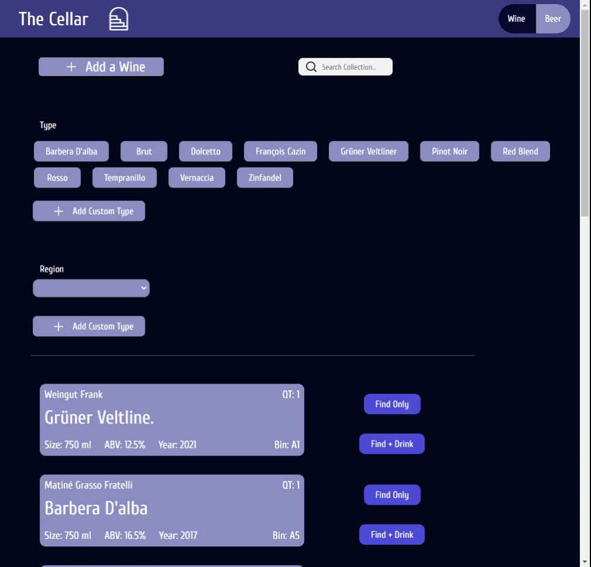

# The Cellar
Welcome to The Cellar. A little hacker project I've been having fun with. This is a work in progress, not production ready code.

# demo

# todos
* Unit Test
* Response values from the microcontroller - probably need to handle this async in java
* Support text search - do fuzzy matching on beverage names, maker names, styles
* moduls for adding new items and drink confirmations
* property files and using properties instead of hardcoded values
